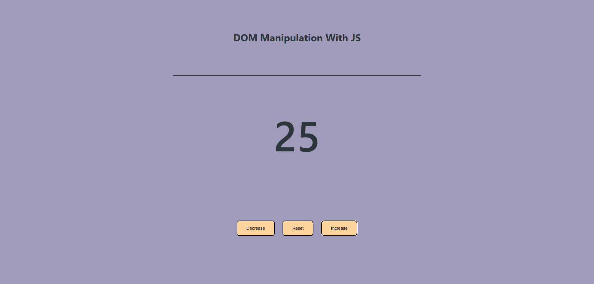

# Counter

A simple counter web app built with HTML, CSS, and JavaScript. It demonstrates basic DOM manipulation.

## Features

- Increase, decrease, and reset the counter using buttons
- Responsive and clean layout
- Subtle button hover effects using CSS transitions

## Screenshot

 

## How to Run

1. Clone the repo
2. Navigate to the `counter` directory
3. Open `index.html` in your browser
4. Use the buttons to manipulate the counter.

---

Made as part of my beginner DOM projects journey 🚀
