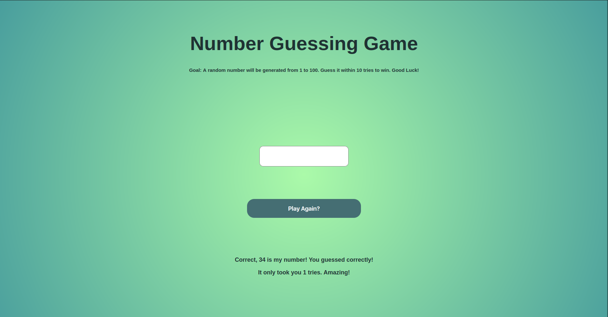

# 🎯 Number Guessing Game

A simple browser-based number guessing game built with **HTML**, **CSS**, and **JavaScript**. Practices input handling, conditionals, DOM manipulation.

## 📜 Description

Guess a randomly generated number between 1 and 100 within 10 tries. The game gives you hints whether your guess is too high or too low. When you guess correctly or run out of tries, you can play again!

## 🕹 How to Play

1. Press **Play** to begin.
2. Enter a number between 1 and 100.
3. Submit your guess.
4. Keep guessing until you either win or run out of tries!

## 🛠 Built With

- HTML5
- CSS3 (including radial-gradient backgrounds)
- Vanilla JavaScript

## 📁 Project Preview

## 🚀 Future Updates

- Make the game mobile-responsive
- Add guess history display
- Animate win/loss screens
- Improve accessibility and semantics

---

Happy guessing!

