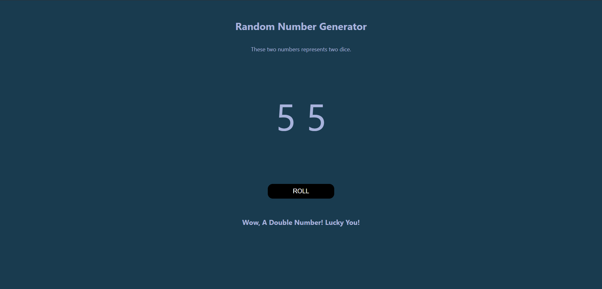

# 🎲 Random Number Generator

This mini project simulates the rolling of two dice. When the "ROLL" button is clicked, two random numbers between 1 and 6 are generated and displayed. If both numbers are the same, a special message appears to celebrate the lucky double!

## 📸 Preview

## 💡 Features

- Generates two random numbers (like rolling dice)
- Displays a special message when a double is rolled
- Tracks streaks of doubles and changes the message accordingly
- Simple, responsive, and styled with CSS

## 🛠️ Tech Stack

- HTML
- CSS
- JavaScript (DOM manipulation)

## 🚀 How to Use

1. Open `index.html` in your browser.
2. Click the "ROLL" button.
3. Enjoy the results and see if you can hit a double!

---

Made as part of my beginner DOM projects journey 🚀
