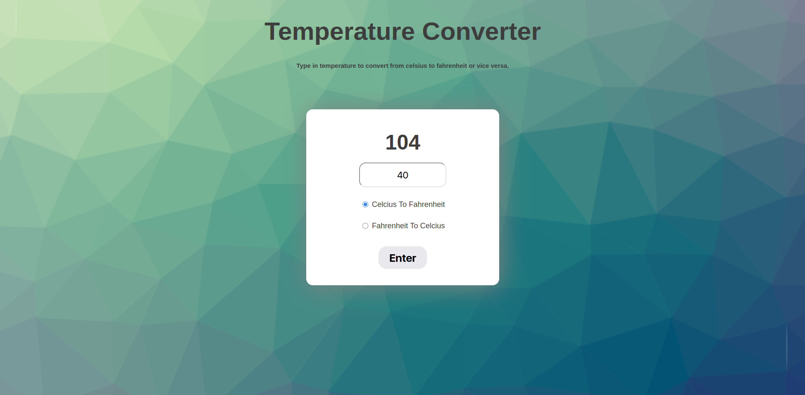

# Temperature Converter

A simple web-based temperature converter that converts Celsius to Fahrenheit and vice versa. Built using HTML, CSS, and JavaScript to practice DOM manipulation skills.

## 📸 Preview

## 🚀 Features

- Convert from Celsius to Fahrenheit
- Convert from Fahrenheit to Celsius
- Input validation (only numbers allowed)
- Rounded results to two decimal places
- Clean and responsive UI

## 🛠️ Technologies Used

- HTML5
- CSS3
- Vanilla JavaScript (DOM manipulation)

## 📖 How to Use

1. Enter a temperature value in the input field.
2. Choose the conversion direction using the radio buttons.
3. Click the **Enter** button to see the converted result.

